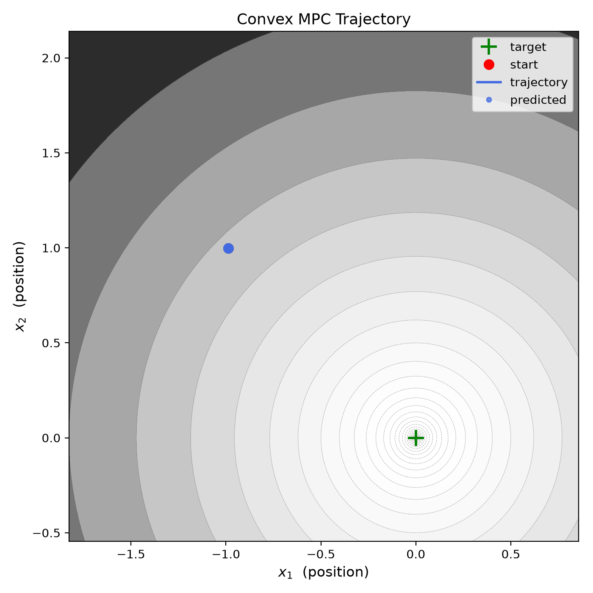
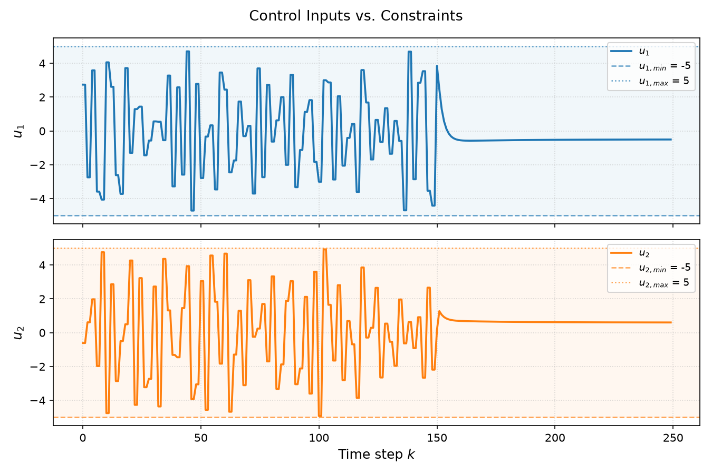
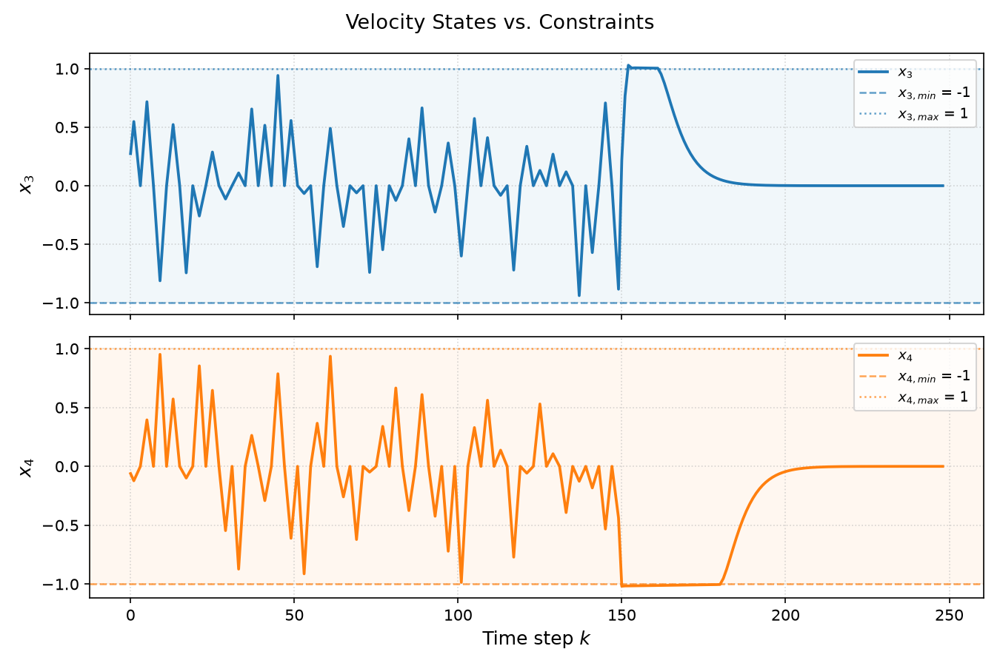
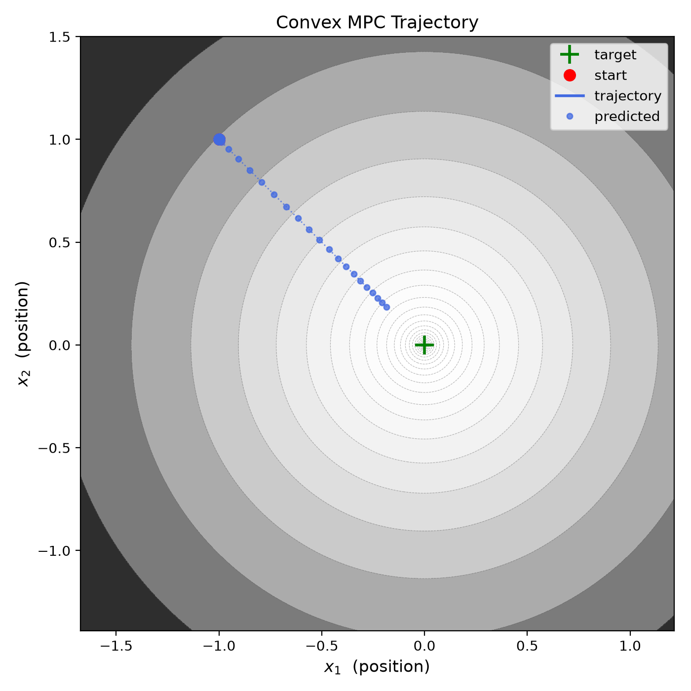
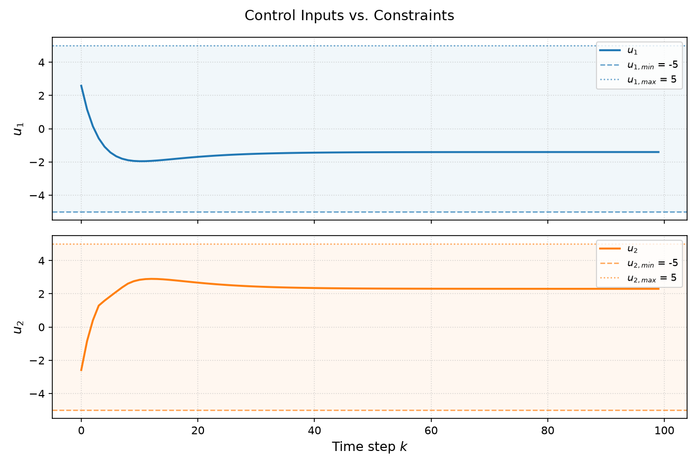
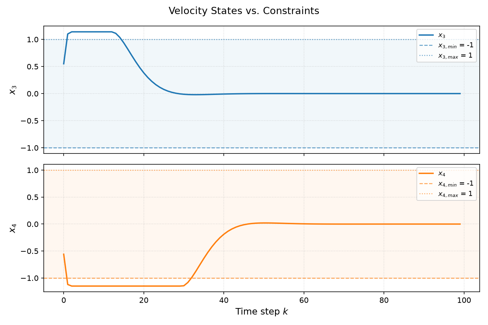

# Convex Data Predictive Control (DPC)

A convex data-driven predictive control (DPC) framework for systems with unknown dynamics operating in biased conditions (e.g., wind). System dynamics are modelled online from data; bias is treated as a disturbance, estimated from prediction residuals; and [cvxpy](https://www.cvxpy.org/) solves the resulting convex optimization at each step.

## Formulation

At each time step $k$, the following convex problem is solved over prediction horizon $h$:

$$\min_{U} \; J = \sum_{i=0}^{h-1} \Bigl[ x(k{+}i)^\top Q\, x(k{+}i) + u(k{+}i)^\top R\, u(k{+}i) \Bigr] + x(k{+}h)^\top P\, x(k{+}h)$$

subject to:

$$x(k{+}i{+}1) = \hat{A}\,x(k{+}i) + \hat{B}\bigl(u(k{+}i) + \hat{d}(k)\bigr), \quad i = 0,\ldots,h{-}1$$

$$x_{\min} \leq x(k{+}i) \leq x_{\max}, \quad i = 1,\ldots,h$$

$$u_{\min} \leq u(k{+}i) \leq u_{\max}, \quad i = 0,\ldots,h{-}1$$

where $Q \succeq 0$, $R \succ 0$, and $P \succeq 0$ are state, input, and terminal cost weights; $\hat{A}$ and $\hat{B}$ are linear time-invariant state transition and input matrix estimates of the plant dynamics; $x$ are states; $u$ are inputs; and $\hat{d}$ is disturbance estimate. Given $\hat{A}$, $\hat{B}$, $Q$, and $R$, the elements of $P$ are automatically derived as the solution to the [Discrete Algebraic Riccati Equation](https://docs.scipy.org/doc/scipy/reference/generated/scipy.linalg.solve_discrete_are.html). 

### Data-driven terms 

The following terms are updated online at every step:

- **Dynamics** — $\hat{A}$, $\hat{B}$, and offset $\hat{c}$ are identified from a sliding window of $n$ input-output samples to minimize the following (see [Data-driven Modelling](#data-driven-modelling)):

$$[\hat{A},\,\hat{B},\,\hat{c}] = \arg\min \sum_{j=1}^{n} \bigl\| x(j{+}1) - \hat{A}\,x(j) - \hat{B}\,u(j) - \hat{c} \bigr\|^2$$

- **Disturbance** — $\hat{d}$ is inferred from the prediction residual via the Moore-Penrose pseudoinverse $\hat{B}^\dagger$ (see [Bias Rejection](#bias-rejection)):

$$\hat{d}(k) = \hat{B}^{\dagger} \Bigl[ x(k) - \hat{A}\,x(k{-}1) - \hat{B}\,u(k{-}1) \Bigr]$$

### Stacked predictions

Within the optimization, dynamics are lifted over the full horizon by generating stacked state and input vectors and *augmented* state-space matrices as follows:

$$X_{\text{pred}} = \hat{\mathcal{A}}\,x(k) + \hat{\mathcal{B}}\,U + \hat{\mathcal{D}}\,\hat{d}$$

where $\hat{\mathcal{A}} \in \mathbb{R}^{h n_x \times n_x}$, $\hat{\mathcal{B}} \in \mathbb{R}^{h n_x \times h n_u}$, $\hat{\mathcal{D}} \in \mathbb{R}^{h n_x \times n_u}$, and $U = [u(k)^\top, \ldots, u(k{+}h{-}1)^\top]^\top$.

### Enforced viability 

A data-driven model is considered viable when the following conditions are satisfied:

- The eigenvalues of the state-transition matrix estimate are stabilizing, such that $\max_i |\lambda_i(\hat A)| \leq 1$

- The combination of $\hat{A}$ and $\hat{B}$ is controllable such that $\text{rank}[\hat{B},\,\hat{A}\hat{B},\,\ldots,\,\hat{A}^{n_x-1}\hat{B}] = n_x$.

## Data-driven Modelling

The plant is modelled as $x(k{+}1) = \hat{A}\,x(k) + \hat{B}\,u(k) + \hat{c}$, with $\hat{A}$ and $\hat{B}$ estimated online using the methodology described below. 

### Excitation

The modes of the plant are excited with random, bounded inputs drawn uniformly from $[u_{\min}, u_{\max}]$. Trajectories are stored in a sliding window of length $n$.

### Incrementation

Only the *state increment* is regressed, rather than the full next state:

$$\Delta x(k) = x(k{+}1) - x(k) = \tilde{A}\,x(k) + \hat{B}\,u(k)$$

This improves numeric conditioning, since $\Delta x$ is typically small relative to $x$. The state transition matrix is recovered as $\hat{A} = I + \tilde{A}$.

### Normalization

Each batch is normalized by the per-feature standard deviation before fitting:

$$x_n = \frac{x}{\sigma_x}, \quad u_n = \frac{u}{\sigma_u}, \quad \Delta x_n = \frac{\Delta x}{\sigma_{\Delta x}}$$

### Regression

A stacked regressor is constructed from the normalized data:

$$Z_n = \begin{bmatrix} X_n \\ U_n \\ \mathbf{1}^\top \end{bmatrix} \in \mathbb{R}^{(n_x + n_u + 1) \times N}$$

Parameter matrix $\Phi_n$ is found by solving $\Delta X_n \approx \Phi_n Z_n$ via [least squares](https://numpy.org/doc/stable/reference/generated/numpy.linalg.lstsq.html), then un-normalized:

$$\tilde{A} = \text{diag}(\sigma_{\Delta x})\;\Phi_n^{(x)}\;\text{diag}(\sigma_x^{-1}), \qquad \hat{B}_{\text{new}} = \text{diag}(\sigma_{\Delta x})\;\Phi_n^{(u)}\;\text{diag}(\sigma_u^{-1})$$

### Learning rate

Parameters from each batch are blended into a running model with learning rate $\alpha \in (0,1]$:

$$\hat{A} \leftarrow (1-\alpha)\,\hat{A} + \alpha\,(I + \tilde{A}), \qquad \hat{B} \leftarrow (1-\alpha)\,\hat{B} + \alpha\,\hat{B}_{\text{new}}$$

### Results

The animation shows a brief excitation phase followed by the controlled trajectory. The control trajectory is produced only after the model passes the viability checks described above [Formulation](#formulation) (i.e., stable and controllable).



| Control Inputs | Velocity States |
|:---:|:---:|
|  |  |


## Bias Rejection

Bias (e.g., wind) is treated as an unknown slowly-varying disturbance $d$ entering through the input channel:

$$x(k+1) = \hat{A}\,x(k) + \hat{B}\bigl(u(k) + \hat{d}\bigr)$$

At each step, $\hat{d}$ is estimated from the prediction residual via $\hat{B}^\dagger$ (described in [Formulation](#formulation)) and fed forward into the stacked prediction used by the optimizer.

### Results

| Without Disturbance Rejection | With Disturbance Rejection |
|:---:|:---:|
|  |  |

Without disturbance rejection the trajectory drifts from the origin; notice the agent also temporarily exceeds constraints. With rejection the estimated disturbance is cancelled in the predictions, restoring convergence.

| Control Inputs | Velocity States |
|:---:|:---:|
|  |  |

## Nonlinear disturbances

Here we see the technique works surprisingly well, even when a nonlinear disturbance field is generated. We generated nonlinear disturbances through a vector field with four rotating vortices and cyclical background winds. While the controller makes a linear assumption internally, the fact that the controller is updated online has the effect of discovering local, linear approximations within this field. 

| Without Disturbance Rejection | With Disturbance Rejection |
|:---:|:---:|
|  |  |


## Discussion

The formulation and results above demonstrate that a convex data-driven predictive control framework can be implemented without requiring a priori knowledge of the plant model. Moreover, the framework is robust to biased conditions (e.g., wind) by estimating and rejecting disturbances online. 

The use of convex optimization ensures the control problem remains tractable and can be solved efficiently at each time step. This approach is applicable to a wide range of systems, provided their dynamics can be approximated as linear and the disturbances are slowly varying.

The linear disturbance rejection technique works well even in nonlinear vortex fields, when estimates are updated online.

## Use

Install dependencies and run:

```bash
pip install -r requirements.txt
python main.py
```

Parameters are configured in `configs/`.

## References

- P. T. Jardine, S. N. Givigi, S. Yousefi and M. J. Korenberg, ["Adaptive MPC Using a Dual Fast Orthogonal Kalman Filter: Application to Quadcopter Altitude Control,"](https://ieeexplore.ieee.org/abstract/document/8207418) in IEEE Systems Journal, vol. 13, no. 1, pp. 973-981, March 2019
- Parts of this project were developed with the assistance of Claude Sonnet 4.6
- Solving the optimization: [cvxpy](https://www.cvxpy.org/)
- Terminal cost via Discrete Algebraic Riccati Equation: [scipy.linalg.solve_discrete_are](https://docs.scipy.org/doc/scipy/reference/generated/scipy.linalg.solve_discrete_are.html)
- Disturbance estimation via Moore-Penrose pseudoinverse: [numpy.linalg.lstsq](https://numpy.org/doc/stable/reference/generated/numpy.linalg.lstsq.html) 
