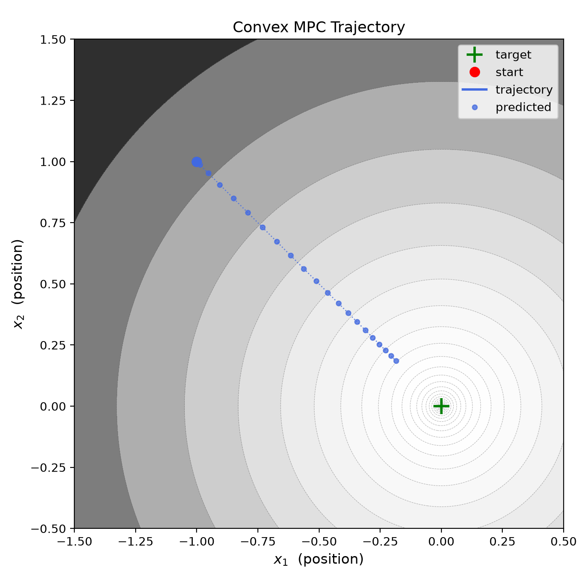
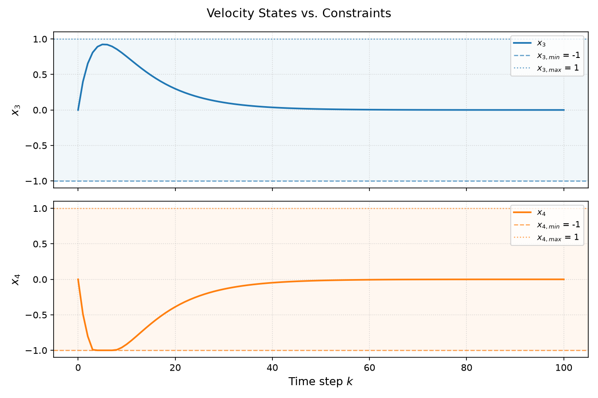

## Windy MPC

The project implements Convex Model Predictive Control (MPC) with online disturbance modelling and rejection for application in windy conditions. We use [cvxpy](https://www.cvxpy.org/) for solving the convex optimization online. 

### Dynamics

Let us consider a system described by the following discrete linear state space at time step $k$:

$$x(k+1) = A x(k) + B\bigl(u(k) + d\bigr)$$

where $A$ is the system matrix, $B$ is the input matrix, $x$ is the state vector, $u$ is the control input vector, and $d$ is an unknown, slowly-varying disturbance.

### Objective

At each time step $k$, the controller solves the following convex optimization problem over a prediction horizon $h$:

$$\min_{u} \; J = \sum_{i=0}^{h-1} \Bigl[ x(k{+}i)^\top Q\, x(k{+}i) + u(k{+}i)^\top R\, u(k{+}i) \Bigr] + x(k{+}h)^\top P\, x(k{+}h)$$

subject to the dynamics above and constraints:

$$x_{\min} \leq x(k+i) \leq x_{\max}, \quad \forall\, i = 1, \ldots, h$$
$$u_{\min} \leq u(k+i) \leq u_{\max}, \quad \forall\, i = 0, \ldots, h-1$$

where $Q \succeq 0$ weighs the state cost, $R \succ 0$ weighs the input cost, and $P \succeq 0$ is the terminal cost (nominally computed as the solution to the [Discrete Algebraic Riccati Equation](https://docs.scipy.org/doc/scipy/reference/generated/scipy.linalg.solve_discrete_are.html)).

### Wind Modelling and Rejection

We treat wind as an unknown disturbance $d$, estimated online from prediction error as follows:

$$\hat{d}(k) = B^\dagger \Bigl[ x(k) - A\,x(k{-}1) - B\,u(k{-}1) \Bigr]$$

where $B^\dagger$ is the [Moore-Penrose pseudoinverse](https://numpy.org/doc/stable/reference/generated/numpy.linalg.lstsq.html) of $B$. This estimate $\hat{d}$ is fed forward into the predicted state sequence during optimization:

$$X_{\text{pred}} = \mathcal{A}\, x(k) + \mathcal{B}\, U + \mathcal{D}\, \hat{d}$$

where $\mathcal{A}$, $\mathcal{B}$, and $\mathcal{D}$ are the system matrices augmented over $h$.

## Results

Below demonstrates the performance of the MPC without and with wind rejection. Wind is simulated as a constant unknown input offset and modelled online using the method described above.

| Without Disturbance Rejection | With Disturbance Rejection |
|:---:|:---:|
|  |  |

Without wind rejection, the controller cannot compensate, causing the trajectory to deviate from the origin. With wind rejection, the estimated disturbance is compensated for in the predictions, resulting in smooth convergence to the origin.

The MPC also enforces hard constraints on both the control inputs and the velocity states throughout the simulation.




## Use

Install dependencies from the requirements file provided and run the simulation:

```bash
pip install -r requirements.txt
python main.py
```
 
Parameters are configured in `config.json`. 

## References

- Parts of this project were developed with the assistance of Claude Sonnet 4.6
- Solving the optimization: [cvxpy](https://www.cvxpy.org/)
- Solving for P using Discrete Algebraic Riccati Equation: [scipy.linalg.solve_discrete_are](https://docs.scipy.org/doc/scipy/reference/generated/scipy.linalg.solve_discrete_are.html)
- Using Moore-Penrose pseudoinverse to solve for disturbance: [numpy.linalg.lstsq](https://numpy.org/doc/stable/reference/generated/numpy.linalg.lstsq.html) 
